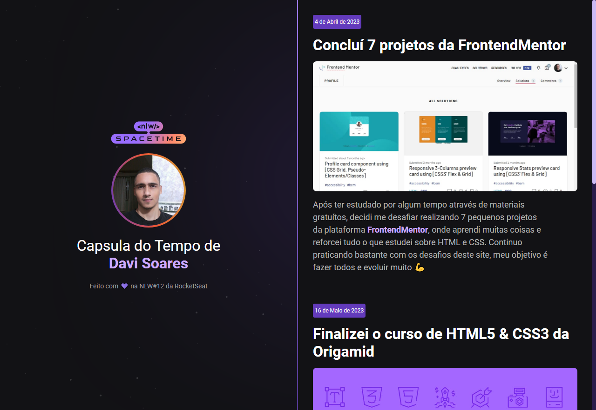

  

## 🖥️ Projeto
Esse é um projeto Web Responsivo de uma cápsula do tempo para exibir memórias em uma linha do tempo.

## 🚀 Tecnologias Utilizadas
Esse projeto foi desenvolvido durante o NLW#12 da Rocketseat com as seguintes tecnologias:

- HTML
- CSS
- Git e Github

## 🏷️ Layout
Você pode visualizar o layout do projeto através 
[desse link](https://nlw-spacetime-explorer.netlify.app/).